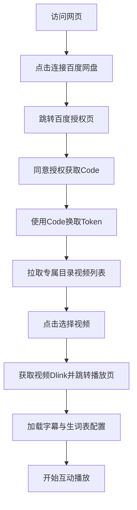

## 1. 产品概述
构建一个面向家长和儿童的 C端（用户端）网页版英语动画播放器。该产品允许家长通过百度网盘授权，将其网盘专属文件夹（沙盒）内的英文动画视频同步到网页中进行播放。在播放过程中，结合预先配置好的生词表（Markdown格式）和字幕文件（VTT格式），实现“视频播放 -> 重点生词时间点自动暂停 -> 弹出带发音和中英释义的卡通单词卡片”的交互式学习体验。

## 2. 核心功能

### 2.1 用户角色
| 角色 | 注册方式 | 核心权限 |
|------|---------------------|------------------|
| C端用户(家长/儿童) | 百度网盘 OAuth 2.0 授权 | 授权访问网盘特定文件夹，浏览并播放其中的视频，体验互动动画词汇卡片 |

### 2.2 功能模块
1. **授权与选集页**：展示百度网盘授权入口，授权后展示沙盒目录（如 `/apps/英语宝贝动画宝`）下的视频列表供用户选择。
2. **沉浸式播放页**：展示视频播放器，加载选定视频的直链（Dlink），并根据对应的词汇表和字幕实现互动播放。

### 2.3 页面详情
| 页面名称 | 模块名称 | 功能描述 |
|-----------|-------------|---------------------|
| 授权选集页 | 授权引导 | 提示用户进行百度网盘授权（沙盒权限），获取 Access Token |
| 授权选集页 | 视频列表 | 授权成功后，调用 API 获取专属目录下的 `.mp4/.mkv` 文件列表，并提供点击进入播放页的功能 |
| 互动播放页 | 视频播放器 | 使用原生 `<video>` 标签结合前端代理播放百度网盘视频直链，支持加载中英文字幕 |
| 互动播放页 | 互动单词卡 | 监听视频播放时间，到达预设时间点自动暂停视频，弹出毛玻璃卡通单词卡片，支持发音播放（可配置音频链接或调用浏览器 TTS），点击继续后恢复播放 |
| 互动播放页 | 数据配置面板(MVP特供) | 为了 MVP 测试，临时提供一个输入框或导入按钮，允许用户粘贴对应的 Markdown 词汇表内容和字幕链接，以模拟未来从数据库加载配置的过程 |

## 3. 核心流程
用户访问网页 -> 点击“连接百度网盘” -> 跳转百度网盘授权页并同意 -> 返回网页并输入授权码(Code) -> 网页获取 Access Token 并拉取网盘专属目录下的视频列表 -> 用户点击某个视频 -> 跳转播放页并加载视频直链 -> 视频播放并在特定时间点弹出单词互动卡片。

## 4. 用户界面设计
### 4.1 设计风格
- 主色调：活泼、温暖的颜色，如浅蓝、嫩黄、马卡龙色系，符合儿童产品调性。
- 按钮风格：圆润、有质感（带轻微阴影或 3D 效果），易于点击。
- 字体：使用清晰、圆润的无衬线字体。
- 布局：以卡片式布局为主，播放页要求沉浸式，尽量最大化视频区域。

### 4.2 页面设计概览
| 页面名称 | 模块名称 | UI 元素 |
|-----------|-------------|-------------|
| 授权选集页 | 授权卡片 | 居中的大按钮，带有百度网盘 Logo 提示，整体背景活泼可爱 |
| 授权选集页 | 视频网格 | 视频封面（或默认插画）、标题、播放按钮图标 |
| 互动播放页 | 播放器区 | 占满主要屏幕空间的视频播放器，带自定义或原生的控制条 |
| 互动播放页 | 单词弹窗 | 位于视频上方的绝对定位卡片，毛玻璃背景（95%透明度），大字号中英双语，卡通配图，明显的声音和继续按钮 |

### 4.3 响应式设计
- 优先适配 iPad 等平板设备（儿童常用），兼容桌面端和手机端。
- 触摸优化：按钮和交互区域需足够大，方便儿童手指点击。