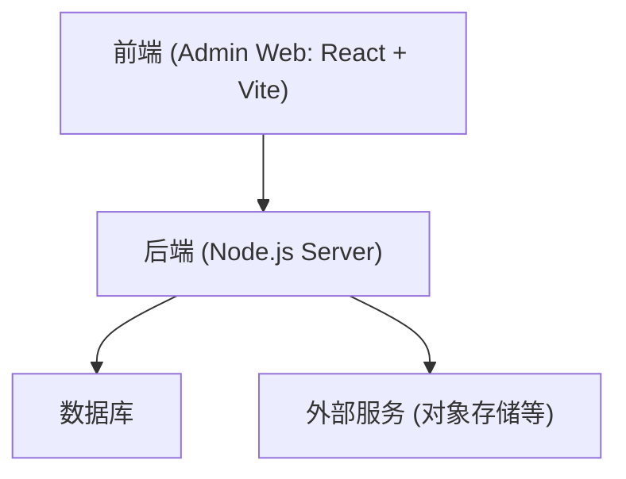
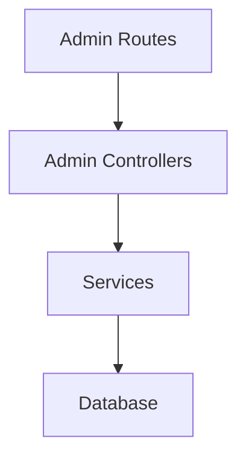
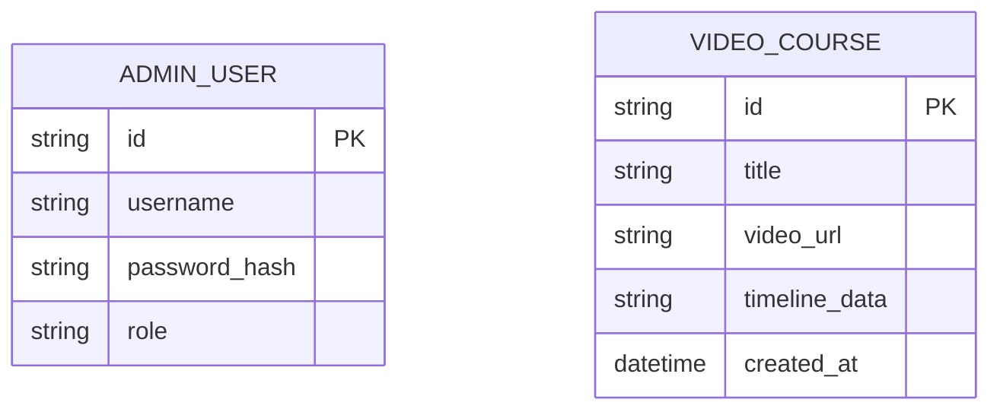

## 1. 架构设计

## 2. 技术说明
- 前端框架：React@18 + Vite
- 路由：React Router v6
- 状态管理：Zustand
- 样式方案：Tailwind CSS (tailwindcss@3)
- UI 组件库：基于 Radix UI / Shadcn UI 或 Ant Design，采用定制化的高级感主题
- 网络请求：Axios
- 初始化工具：vite

## 3. 路由定义
| 路由 | 用途 |
|------|------|
| /login | 后台管理员登录页面 |
| / | 控制台数据大盘 |
| /content/videos | 视频及课件管理列表 |
| /content/edit/:id | 课件交互时间轴编辑页 |
| /users | 小程序用户管理 |
| /settings/accounts | 后台管理员账号设置 |

## 4. API 定义
将与现有的 `server` 项目结合，暂定需要以下基础接口：
- `POST /api/admin/login` - 管理员登录鉴权
- `GET /api/admin/dashboard` - 获取大盘统计数据
- `GET /api/admin/videos` - 获取视频及课件列表
- `POST /api/admin/videos` - 新增/更新视频课件
- `GET /api/admin/users` - 获取小程序用户列表

## 5. 服务端架构图
将在现有的 `server` 服务中进行扩展。

## 6. 数据模型
### 6.1 数据模型定义

